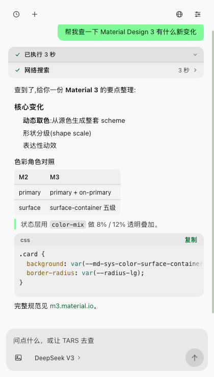
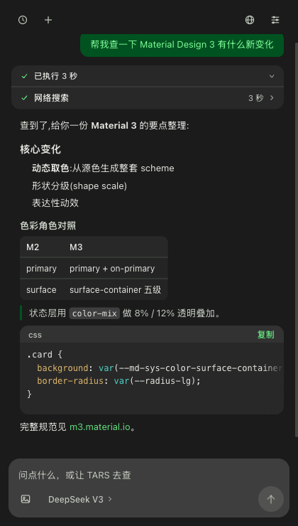
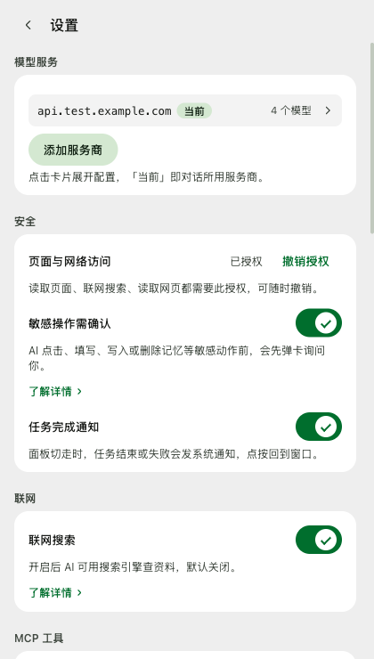
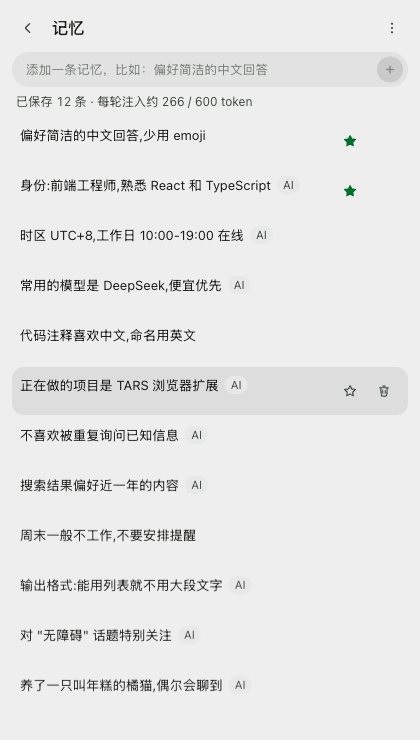

<div align="center">


# TARS

> 住在浏览器侧栏的 agent：读你正在看的页面，替你联网查，替你点按填写。
> 名字来自《星际穿越》里那个机器人：诚实值 90%，幽默值 75%，冷笑话讲得一般，活儿干得漂亮。

**Chrome MV3 扩展 · BYOK（需要你自己的模型 Key）· 数据不出本机 · 安装零站点权限**

[](https://github.com/404notfxxked/TARS-sidebar-agent/releases)
[](https://github.com/404notfxxked/TARS-sidebar-agent/actions/workflows/checks.yml)
[](https://developer.chrome.com/docs/extensions/develop/mv3/mv3-migration)
[](LICENSE)

<table>
  <tr>
    <td></td>
    <td></td>
  </tr>
  <tr>
    <td></td>
    <td></td>
  </tr>
</table>

</div>

一个 Chrome MV3 扩展，内置手写的 ReAct agent 循环（推理 → 工具调用 → 观察 → 再推理）。BYOK 接入任意 OpenAI 兼容端点——DeepSeek、Kimi、OpenRouter、本地 Ollama 都行；没有账号和后端，不收订阅费：Key、数据、模型账单都归你自己。

两句实话帮你判断适不适合装：没有 Key 它就完全不工作——零配置的「侧栏问答」是平台内置侧栏在做的事；它比后者多的是**页面操作**（替你点按填写，逐次过确认卡）与**可审计**（开源、零后端、数据不出本机）。

常见的侧栏 AI 助手大多要求订阅、把对话送到厂商后端；接本地模型的侧栏则往往只是个聊天窗口。TARS 把「代理」用成动词——真的能读懂长页面、操作页面、带着工具箱上网。

## ✨ 功能

- 📖 **读页答疑** — 当前页面转成结构化 markdown 再喂给模型；长文档支持大纲、关键词定位、分窗阅读，不会刷爆上下文
- 🖱️ **页面操作** — 模拟真实鼠标点击、表单填写与回车提交，React 受控组件也能正确感知；执行前弹确认卡供你放行（目标页面、写入内容一目了然），只在明确要求时才动页面。确认卡同样把守长期记忆的写入/删除，以及读取网页时对内网地址、会话未见过的域的访问（首次抓取新域确认一次）
- 🔍 **联网搜索** — 默认关闭；开启即用且无需任何 Key：后台短暂打开真实搜索引擎标签页（DuckDuckGo / Bing / Google / 百度），读取完整渲染的结果页后立即关闭，引擎按健康表动态排序；「API 格式」选 Anthropic Messages 的供应商改由模型服务商在服务端搜索（如 DeepSeek 原生搜索），不开标签页、也不需要网页授权——端点不支持该服务端工具时报错，把该供应商改用 Chat Completions 格式即可回到标签页通道；进阶用户仍可手动配置 Tavily / 博查 / Brave API
- 🌐 **读取网页** — 给它一个链接即可读正文，长文分页读，GBK 等编码自动识别
- 👁️ **页面截图（视觉通道）** — 视觉模型可以直接「看」页面：截取当前视口并给可交互元素画上编号框，编号与选择器对照表随结果一起回来（截图字节不进工具消息与诊断日志），字体反爬、canvas 渲染、图片即内容这类「DOM 读不出」的页面有了逃生通道；配套滚动原语（按视口倍数滚动 / 把元素滚入视口）让「截图 → 滚动 → 再截」的视觉循环可用；非视觉模型自动隐藏该工具。仅支持 http/https 页面，站点授权要求与读页一致
- ⚡ **技能** — 安装 SKILL.md 格式的任务指令包（兼容 Agent Skills 开放标准），输入 `/` 呼出联想菜单随时调用；自带管理页，可编辑、停用、删除
- 🧠 **长期记忆** — 明说「记住…」、或陈述明确的偏好与个人信息，即可跨会话记住；稳定事实存成可更新的卡片，每轮自动携带，记忆页随时查看管理
- 🔌 **MCP 服务器接入** — 远程 MCP 服务器的工具自动并入工具箱（GitHub / Linear 等托管端点或本机 HTTP 端点），支持新旧两代协议与自定义请求头；工具可逐个启停（禁用的不进模型，省 token），支持粘贴 JSON 配置一键导入，连接失败时 AI 会转告原因而不是无声失败
- 🖼️ **图片输入** — 选图或粘贴发给视觉模型，面板内自动压缩转码，无视觉能力不出现入口
- 🧩 **多供应商模型** — 保存多个模型服务随时切换，模型选择器按供应商分组；每个服务可选「API 格式」：Chat Completions（OpenAI 兼容，既有配置缺省不变）或 Anthropic Messages（Claude 官方及一切兼容端点，工具调用 / 图片输入 / 流式 / 压缩全链路可用）；每个模型可独立配置上下文窗口、最大输出与视觉能力，「获取模型列表」时按 [models.dev](https://models.dev) 目录快照预填上下文窗口与推理、视觉能力，识别不准可在模型设置里手动纠正
- 🎚️ **思考档位** — 推理模型的输入行出现「思考」档位按钮，选项按模型逐个给出（含「关」，不支持关闭的模型不显示），未选时取目录折中档；推理开关就是这个档位（设置页不另设总开关），选择对该模型的后续所有对话生效
- 🗜 **上下文自动压缩** — 对话过长时自动把较早轮次压成结构化摘要，长会话不「失忆」；三档触发时机，摘要可指定便宜模型生成，聊天记录本身不受影响
- 🌗 深浅色主题 · 8 套重点色 · 界面语言切换（简体中文 / English）· 多会话历史 · 任务完成系统通知 · 诊断日志导出

## 🔒 隐私与数据

TARS 没有后端，谈不上「上传」：

- **安装零站点授权**：manifest 不声明任何 host 权限。读取页面、联网搜索、按链接读网页，需要你在 设置 → 安全 里用 Chrome 标准弹窗显式授权「页面与网络访问」（可随时撤销）；模型端点在添加服务时按域单独授权
- 对话、记忆、技能、设置与 API Key **只存在你的浏览器里**（IndexedDB + `chrome.storage.local`），卸载扩展即消失
- 模型请求从你的浏览器**直连你配置的端点**，途中没有第三台服务器；日志在导出前自动脱敏 Key
- 打开联网搜索后，搜索词会发给搜索引擎 / 你配置的搜索服务；「API 格式」选 Anthropic Messages 的供应商则由模型服务商在服务端搜索。启用 MCP 工具后，相关请求内容会发给对应服务器——两类能力都默认关闭、开启时界面明示
- 源码即声明：一切请求路径都可以在代码里直接验证；逐项细节（数据存哪、发给谁、权限各管什么、你控制哪些）见 [PRIVACY.md](PRIVACY.md)

## 📦 安装

要求 **Chrome ≥ 116**（`minimum_chrome_version` 在 manifest 里声明）；从源码构建另需 Node ≥ 20、pnpm ≥ 10。

**方式一：下载安装包**

1. 到 [Releases](https://github.com/404notfxxked/TARS-sidebar-agent/releases) 下载最新版的 zip 并解压（解压得到一个含 `manifest.json` 的文件夹）
2. 打开 `chrome://extensions`，开启右上角「开发者模式」
3. 点「加载已解压的扩展程序」，选择解压出的文件夹
4. 点工具栏图标打开侧栏，在设置里填入 Base URL 与 API Key（例如 `https://api.deepseek.com/v1`）
5. 想让它读页面 / 联网 / 操作网页：到 设置 → 安全 点「授权页面与网络访问」；不需要读页问答的话，跳过这步也能正常聊天

**方式二：从源码构建**

```bash
git clone https://github.com/404notfxxked/TARS-sidebar-agent.git
cd TARS-sidebar-agent
pnpm install
pnpm build        # 产物输出到 dist/
```

然后同方式一的第 2~5 步（第 3 步选择 `dist/` 目录）。

「联网搜索」默认关闭：开启后默认走免 Key 的真实搜索引擎标签页通道（后台短暂开页、读完即关）。API 搜索服务（Tavily / Bocha / Brave）通道保留但无设置界面，需手动写入配置才能启用。关闭状态下 TARS 不为搜索 / 读网页发出任何联网请求，也不存在任何后台常驻外发请求。

## 💡 使用须知

- **安装后默认不读任何页面**：站点授权是显式的——读页 / 搜索 / 读网页前到 设置 → 安全 授权一次即可，撤销立即生效；模型端点在添加服务时单独按域授权
- **首条回复偏慢**：MV3 的 service worker 按需冷启动 + 首次连接模型端点，属预期；同会话后续请求正常速度
- **搜索时会看到一闪而过的标签页**：免 Key 通道靠真实搜索引擎标签页拿完整结果页，读完即自动关闭、不留痕迹；引擎健康表会记住哪些引擎在你当前网络下好用，不可达的自动沉底。（选 Anthropic Messages 格式的供应商走服务端搜索，不开页）
- **清除浏览数据会连带清掉会话历史**：会话按 7 天短命数据设计（可调或关闭），重要内容别指望它长期保存
- **MCP 仅支持远程 HTTP 服务器**：需要本地进程的 stdio 服务器不支持（零安装的产品取舍）

## 🧭 架构

```
sidepanel (React) ⇄ port（消息协议）⇄ Service Worker
                                      ├─ agent/     ReAct 循环 · 上下文压缩
                                      ├─ provider/  模型适配器（Chat Completions / Anthropic Messages）
                                      ├─ tools/     内置工具注册表（读页/操作/记忆…）
                                      ├─ web/       联网搜索 · 网页抓取
                                      ├─ mcp/       远程 MCP 服务器接入
                                      ├─ sessions/  会话持久化（IndexedDB）
                                      ├─ memory/    长期记忆
├─ offscreen doc   HTML → markdown 解析（SW 无 DOM）
└─ content script  页面感知与操作（按需注入,只碰被授权的页面）
```

MV3 的 service worker 没有 DOM 且随时休眠——解析放进 offscreen document，状态即时落盘，网络全部收归 SW，面板只管渲染。设计取舍写在各模块的文件头注释里。

## 🛠 设计上的几处较真

- **手写 ReAct 循环，不用框架**：裁剪、预算、取消传播、超步收尾这些框架替你做的默认值，都在自己手里，每段可讲清为什么
- **虚拟上下文**：裁剪与压缩只改「发给模型的 prompt」，落盘永远全量——历史与记忆随时可摘除，界面回放与模型所见互不污染
- **确定性 E2E**：CDP Fetch 层拦截扩展上下文的真实网络请求，mock LLM 按脚本驱动真循环、断言锚定日志与实库；纯逻辑另有 vitest 单测层。跑法：`pnpm test`（单测）、`node tests/run.mjs <域>`（E2E 按域，明细见 [tests/README.md](tests/README.md)）
- **无 UI 组件库**：Material 3 配色由单一源色生成，深浅色 × 8 套重点色共用一套设计令牌

## 🤝 贡献

问题与建议欢迎提 [Issues](https://github.com/404notfxxked/TARS-sidebar-agent/issues)。想动代码的话，先读 [AGENTS.md](AGENTS.md)（开发约定）与 [tests/README.md](tests/README.md)（测试地图），提交前跑通门禁：`pnpm lint && pnpm typecheck && pnpm test && pnpm build`。

## 🙏 致谢

- [models.dev](https://models.dev)（MIT）— 模型能力目录的数据来源。「获取模型列表」时预填的上下文窗口、推理与多模态推荐值来自其社区维护的快照（`public/model-catalog.json`，`pnpm catalog:refresh` 刷新），识别不准的可在模型设置里手动纠正。

## 📄 License

[MIT](LICENSE)。第三方依赖：React（MIT）、turndown（BSD-3-Clause）、highlight.js（BSD-3-Clause）、tailwindcss（MIT）——完整清单见 [package.json](package.json) 与 `pnpm-lock.yaml`。

版本变更见 [CHANGELOG](CHANGELOG.md)。
